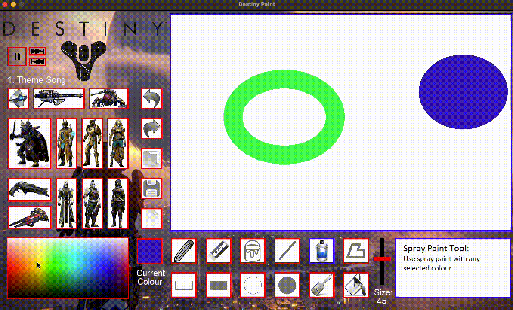
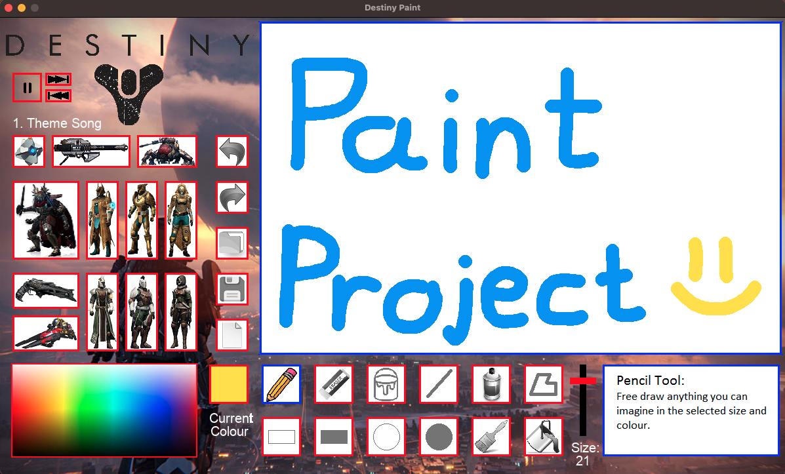

# Paint Project

A [Destiny](https://www.destinythegame.com/) themed remake of [Microsoft Paint](https://apps.microsoft.com/store/detail/paint/9PCFS5B6T72H) using Python and Pygame! ([Demo Video](https://youtu.be/nuKwbmnTy1g))

Course: Computer Science ICS3U (Grade 11)  
Date: February 3rd, 2017  
Grade: 100%

## Table of Contents
 
[1. Demo](#Demo)  
[2. Environment Setup](#Environment-Setup)  
[3. How to Use](#How-to-Use)  
[4. Results](#Results)  
[5. Next Steps](#Next-Steps)

## Demo

Check out the demo video for this project [here](https://youtu.be/nuKwbmnTy1g)!

  

## Environment Setup

To successfully run this project, please follow these steps to set up your environment:

1. Python 3.0 or later ([Download Python](https://www.python.org/downloads/))
2. Any IDE that runs Python (we recommend [IDLE](https://www.python.org/downloads/), [IntelliJ IDEA](https://www.jetbrains.com/idea/) or [VS Code](https://code.visualstudio.com/download))
3. PyGame Module installed to your version of Python ([Download PyGame](https://www.python.org/downloads/))
4. Ensure your IDE is configured to use the above version of Python and PyGame

## How to Use

No instructions here, just run the [PaintProject.py](PaintProject.py) file!

## Results

As this was my first ever programming project, I am very happy of the final product (and the grade)! 

I think what was more important was the experience I gained from this project. I learned a lot about programming, computer science, and the process of building a full application from scratch.

I enjoyed learning the basics of programming, which included variables, loops, conditionals, and functions. I really liked the ability to add my own theme to this program, and it was cool seeing what my classmates did with their themes and paint projects.

**Grade: 100%**

## Next Steps
Some fun things I would like to build on or explore relating to this project would be:

- Additional features including text, shapes, and other more complex tools
- Ability to save and load custom images
